# Balancr — Cloud-Native Web Application with Serverless Event-Driven Architecture

> A minimalist banking website deployed on AWS using S3, CloudFront, Lambda, API Gateway, and SES — combining static hosting with a serverless contact pipeline.

**Live Site:** [codeandcloud.site](https://codeandcloud.site)

---

## Overview

Balancr is a cloud-native static banking website deployed entirely on AWS managed services — no traditional web server required. The project demonstrates two distinct AWS architectural patterns:

1. **Static hosting with global CDN delivery** — HTML, CSS, and JavaScript files served from S3 via CloudFront across 400+ edge locations worldwide
2. **Serverless event-driven contact pipeline** — a contact form that triggers a Lambda function on every submission, delivering email notifications via SES with zero server management

---

## Architecture

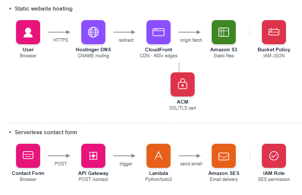

```
User Browser
     ↓ HTTPS (codeandcloud.site)
Hostinger DNS → CNAME → CloudFront Distribution
     ↓
CloudFront (400+ edge locations, SSL termination)
     ↓
S3 Bucket (static files)

Contact Form Submission
     ↓ POST /contact
API Gateway (HTTP API)
     ↓ trigger
Lambda Function (Python/boto3)
     ↓
SES → Email Delivery
```

---

## AWS Services Used

| Service | Purpose |
|---|---|
| **S3** | Stores and hosts static website files (HTML, CSS, JS, images) |
| **CloudFront** | Global CDN — caches and delivers content from 400+ edge locations |
| **ACM** | Provisions and manages SSL/TLS certificate for HTTPS |
| **API Gateway** | Exposes public HTTP endpoint for contact form POST requests |
| **Lambda** | Serverless function that processes form submissions and triggers email |
| **SES** | Sends email notification on every contact form submission |
| **IAM** | Execution role granting Lambda least-privilege permission to invoke SES |
| **Hostinger DNS** | CNAME record pointing custom domain to CloudFront distribution |

---

## Static Website Hosting on S3 + CloudFront

### What It Does
Serves the Balancr banking website globally with HTTPS on a custom domain.

### How It Works

**S3 Static Hosting**
- Website files (index.html, style.css, script.js, images) uploaded to S3 bucket
- Static website hosting enabled — S3 serves index.html as the entry point
- Bucket policy configured to allow public read access to all objects

**CloudFront CDN**
- CloudFront distribution created with S3 website endpoint as the origin
- Viewer protocol policy set to redirect HTTP → HTTPS automatically
- Content cached at edge locations closest to each visitor — reducing latency significantly compared to serving from a single S3 origin region

**Custom Domain + HTTPS**
- SSL/TLS certificate provisioned via ACM (us-east-1) for `codeandcloud.site`
- DNS validated using CNAME record added to Hostinger DNS settings
- CloudFront alternate domain name configured with ACM certificate attached
- CNAME record in Hostinger points `codeandcloud.site` to CloudFront distribution domain

### Screenshots

**S3 Bucket with Files**
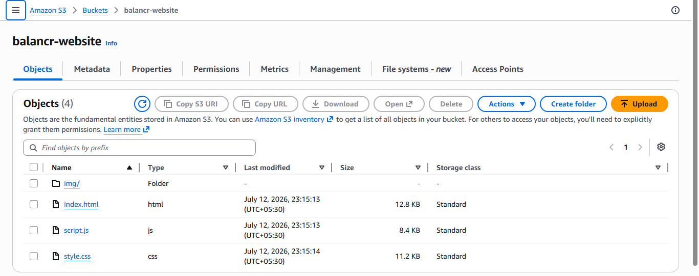

**CloudFront Distribution**
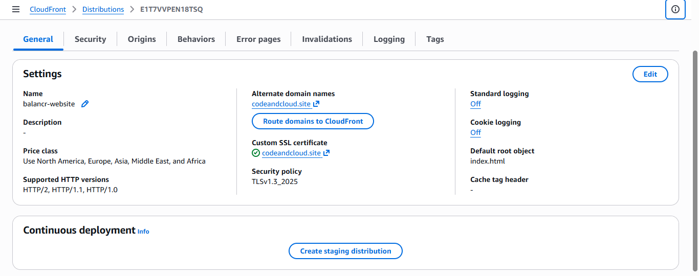

**ACM Certificate — Issued**
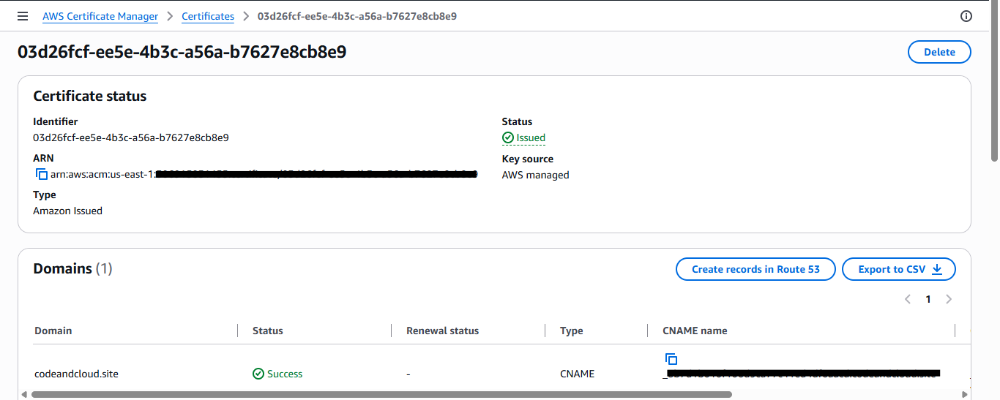

**Live Site with HTTPS**
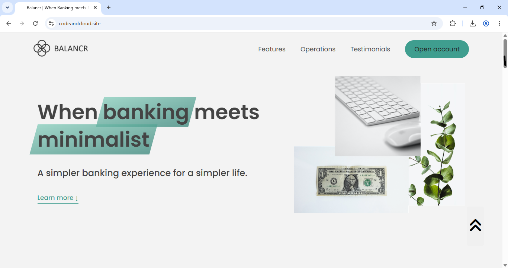

**Connection Secure**
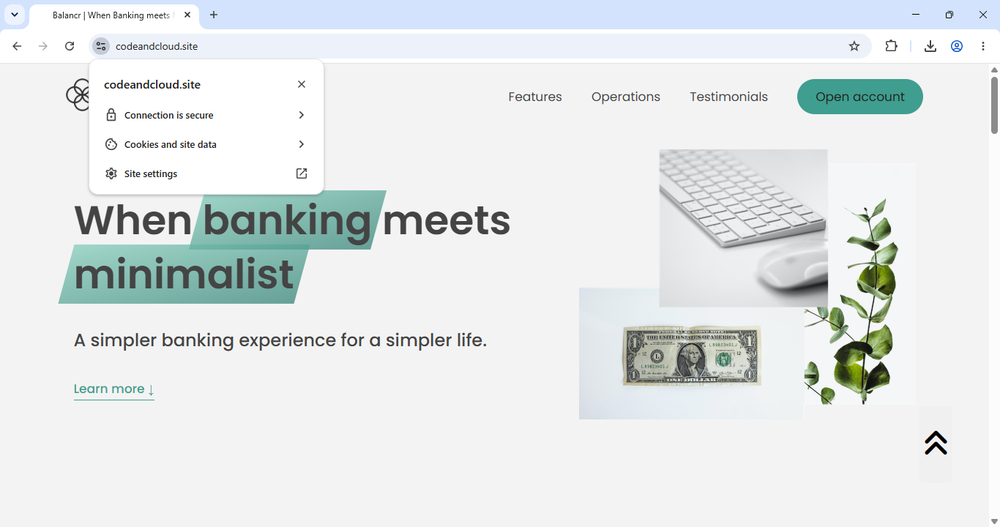

---

## Serverless Contact Form (Lambda + API Gateway + SES)

### What It Does
Processes contact form submissions and delivers email notifications — entirely serverless, scales automatically, zero server management.

### How It Works

**API Gateway**
- HTTP API created with a `POST /contact` route
- CORS configured to allow requests from `codeandcloud.site`
- Routes POST requests directly to Lambda function

**Lambda Function (Python)**
- Triggered by every POST request to API Gateway
- Extracts name, email, and message from the request body
- Calls SES to send a formatted email notification
- Returns success/error response back to the browser

**SES**
- Email address verified in SES sandbox
- Lambda sends email via `boto3` SES client
- Delivers contact form details to inbox on every submission

**IAM**
- Lambda execution role created automatically
- `AmazonSESFullAccess` policy attached — least-privilege access
- Lambda can only invoke SES — no other AWS service permissions

### Contact Form Flow

```
User fills form → clicks Submit
        ↓
JavaScript fetch() → POST /contact → API Gateway
        ↓
API Gateway triggers Lambda
        ↓
Lambda extracts form data → calls SES
        ↓
SES delivers email to inbox
        ↓
Lambda returns 200 → browser shows "Message sent successfully"
```

### Screenshots

**Lambda Function Code**
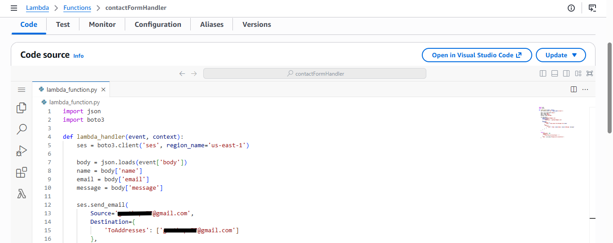
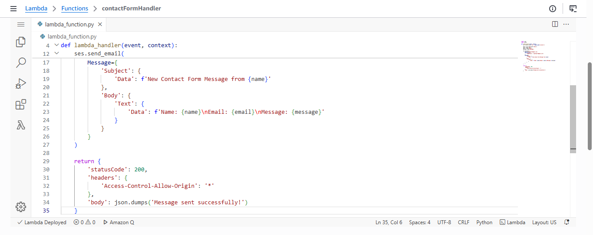

**Lambda Trigger — API Gateway**
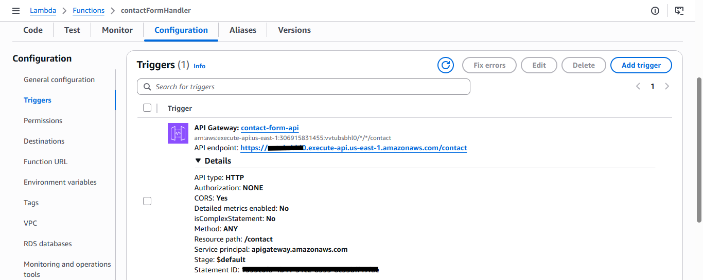

**API Gateway Routes**
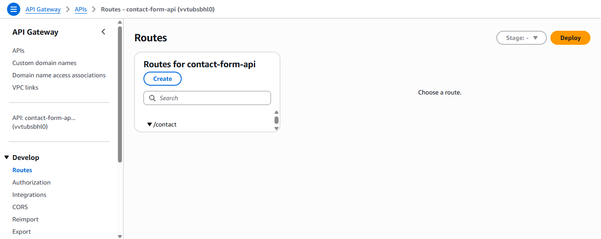

**SES Verified Identity**
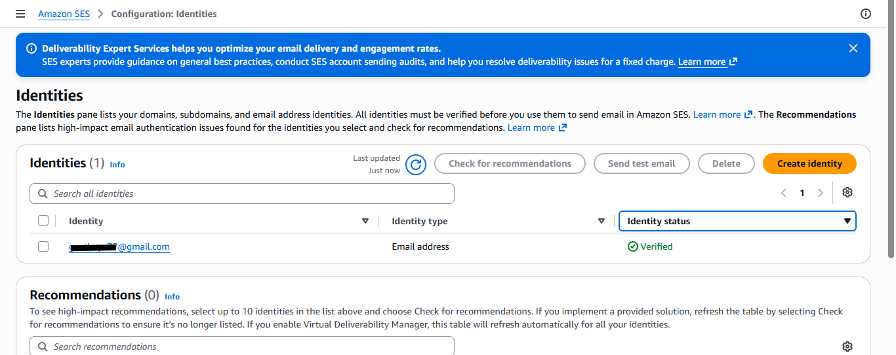

**Contact Form on Live Site**
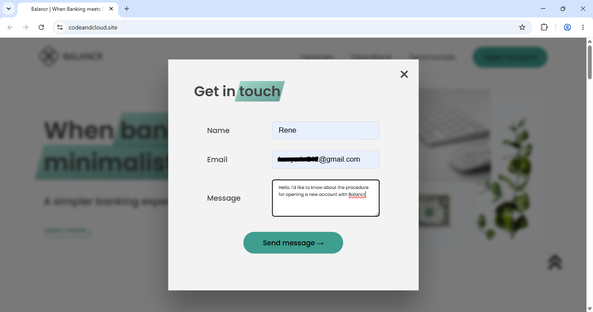

**Message sent successfully**
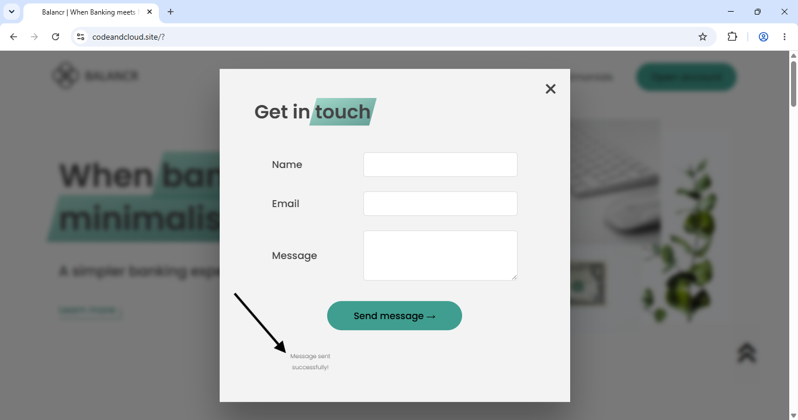

**Email Received**
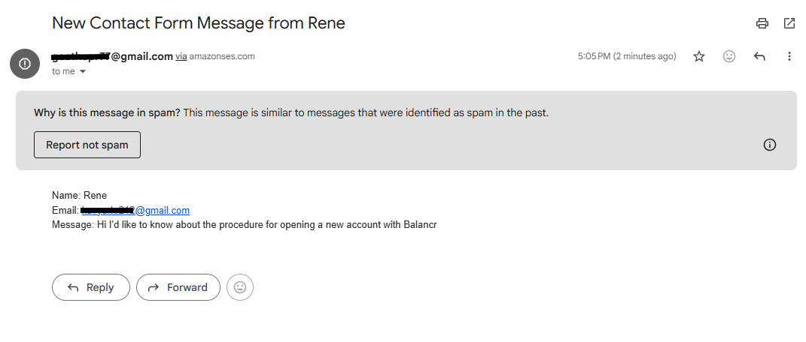

---

## Key Technical Decisions

**Why S3 + CloudFront over AWS Amplify?**
Amplify abstracts the underlying services — you get a working deployment but lose visibility into what's actually happening. 
By configuring S3, CloudFront, and ACM manually, each component is fully understood and independently configurable. This approach also provides finer control over cache behaviors, security headers, and CDN settings that Amplify doesn't expose directly.

**Why serverless for the contact form?**
A contact form receives occasional submissions — not continuous traffic. Running a traditional server 24/7 to handle infrequent requests is wasteful. Lambda runs only when triggered, costs nothing when idle, and scales automatically to handle any volume of submissions.

**Why IAM least-privilege for Lambda?**
The Lambda function only needs to send emails — nothing else. Attaching only `AmazonSESFullAccess` means even if the function were compromised, an attacker could only send emails via SES — they couldn't access S3, EC2, RDS, or any other service.

---

## Tech Stack

- **Frontend:** HTML5, CSS3, JavaScript (ES6+)
- **Cloud:** AWS S3, CloudFront, ACM, API Gateway, Lambda, SES, IAM
- **Backend (Serverless):** Python 3, boto3
- **DNS:** Hostinger
- **Version Control:** Git, GitHub

---

## Live Demo

Visit [codeandcloud.site](https://codeandcloud.site) to see the live site.

Click **Open Account** to open the contact form and submit a message.

---

## Author

**Geethu P R** — [GitHub](https://github.com/geeth34/) | [LinkedIn](https://linkedin.com/in/geethupr/)
