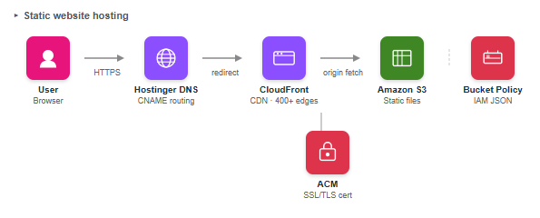

# Balancr — Cloud-Native Web Application with Serverless Event-Driven Architecture

> A minimalist banking website deployed on AWS using S3, CloudFront, Lambda, API Gateway, and SES — combining static hosting with a serverless contact pipeline.

**Live Site:** [codeandcloud.site](https://codeandcloud.site)

---

## Overview

Balancr is a cloud-native static banking website deployed entirely on AWS managed services — no traditional web server required. The project demonstrates two distinct AWS architectural patterns:

1. **Static hosting with global CDN delivery** — HTML, CSS, and JavaScript files served from S3 via CloudFront across 400+ edge locations worldwide
2. **Serverless event-driven contact pipeline** — a contact form that triggers a Lambda function on every submission, delivering email notifications via SES with zero server management

---

## Architecture



```
User Browser
     ↓ HTTPS (codeandcloud.site)
Hostinger DNS → CNAME → CloudFront Distribution
     ↓
CloudFront (400+ edge locations, SSL termination)
     ↓
S3 Bucket (static files)

Contact Form Submission
     ↓ POST /contact
API Gateway (HTTP API)
     ↓ trigger
Lambda Function (Python/boto3)
     ↓
SES → Email Delivery
```

---
